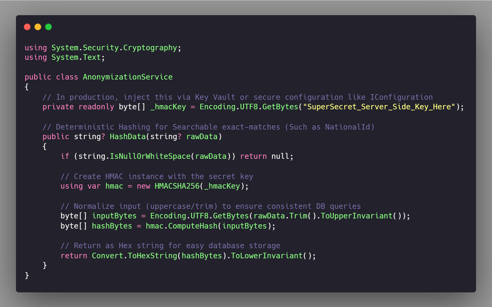
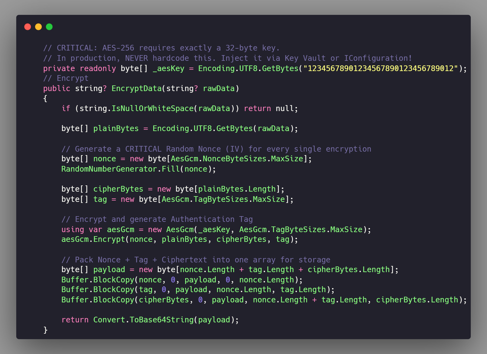
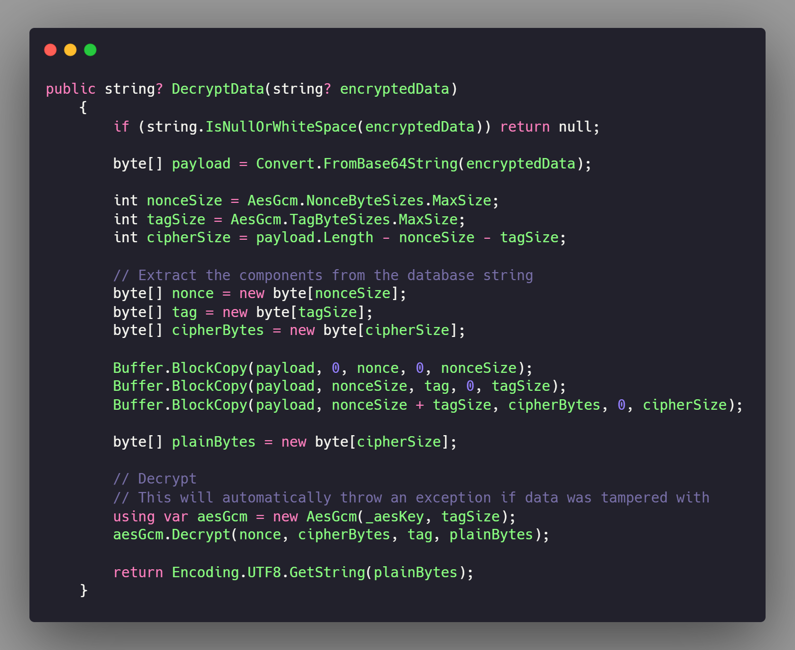

# 🔐 HIPAA-Compliant Data Anonymization Service (.NET Core)


A robust, enterprise-grade cryptographic service built in ASP.NET Core for securing Personally Identifiable Information (PII) and Protected Health Information (PHI) in relational databases.

## 🚨 The Problem

Storing sensitive medical data (like National IDs, Phone Numbers, and Names) in plaintext violates strict healthcare regulations such as HIPAA. A compromised database directly leads to identity exposure. This repository demonstrates a highly secure architectural pattern to ensure that stolen database records remain mathematically unreadable.

## 💡 The Solution: A Two-Pronged Cryptographic Architecture

Not all database fields serve the same purpose. This service implements two distinct strategies based on data usage requirements.

### 1️⃣ Deterministic Hashing (For Searchable Data)

For fields requiring exact-match queries (e.g., searching for a patient by `NationalId`), two-way encryption degrades database index performance and adds unnecessary complexity.

- **Implementation:** `HMACSHA256`
- **Mechanism:** Uses a server-side secret key to hash normalized data.
- **Advantage:** Allows `WHERE NationalIdHash = @hash` queries while neutralizing Rainbow Table attacks if the database is leaked.

### 2️⃣ Authenticated Encryption (For Recoverable Data)

For data that must be read and displayed back to the UI (e.g., `Phone`, `Address`), hashing is impossible.

- **Implementation:** `AES-GCM` (Galois/Counter Mode)
- **Mechanism:** Replaces legacy AES-CBC. It dynamically generates a cryptographically secure, randomized `Nonce` (IV) for _every single row_.
- **Advantage:** Encrypting the same phone number twice yields completely different byte structures, preventing pattern recognition. The included Authentication Tag ensures the database payload has not been tampered with.

---

## 🏗️ Implementation Details

### Service Methods

#### Hashing (HMACSHA256)

```csharp
// In production, inject this via Key Vault or secure configuration like IConfiguration
private readonly byte[] _hmacKey = Encoding.UTF8.GetBytes("Secret_Server_Side_Key_Here");
// Deterministic Hashing for Searchable exact-matches (Such as NationalId)
public string? HashData(string? rawData)
{
    if (string.IsNullOrWhiteSpace(rawData)) return null;

    // 1. Create HMAC instance with the secret key
    using var hmac = new HMACSHA256(_hmacKey);

    // 2. Normalize input (uppercase/trim) to ensure consistent DB queries
    byte[] inputBytes = Encoding.UTF8.GetBytes(rawData.Trim().ToUpperInvariant());
    byte[] hashBytes = hmac.ComputeHash(inputBytes);

    // 3. Return as Hex string for easy database storage
    return Convert.ToHexString(hashBytes).ToLowerInvariant();
}
```



#### Encryption & Decryption (AES-GCM)

```csharp
// CRITICAL: AES-256 requires exactly a 32-byte key.
// In production, NEVER hardcode this. Inject it via Key Vault or IConfiguration!
private readonly byte[] _aesKey = Encoding.UTF8.GetBytes("12345678901234567890123456789012");
// Encrypt
public string? EncryptData(string? rawData)
{
    if (string.IsNullOrWhiteSpace(rawData)) return null;

    byte[] plainBytes = Encoding.UTF8.GetBytes(rawData);

    // Generate a CRITICAL Random Nonce (IV) for every single encryption
    byte[] nonce = new byte[AesGcm.NonceByteSizes.MaxSize];
    RandomNumberGenerator.Fill(nonce);

    byte[] cipherBytes = new byte[plainBytes.Length];
    byte[] tag = new byte[AesGcm.TagByteSizes.MaxSize];

    // Encrypt and generate Authentication Tag
    using var aesGcm = new AesGcm(_aesKey, AesGcm.TagByteSizes.MaxSize);
    aesGcm.Encrypt(nonce, plainBytes, cipherBytes, tag);

    // Pack Nonce + Tag + Ciphertext into one array for storage
    byte[] payload = new byte[nonce.Length + tag.Length + cipherBytes.Length];
    Buffer.BlockCopy(nonce, 0, payload, 0, nonce.Length);
    Buffer.BlockCopy(tag, 0, payload, nonce.Length, tag.Length);
    Buffer.BlockCopy(cipherBytes, 0, payload, nonce.Length + tag.Length, cipherBytes.Length);

    return Convert.ToBase64String(payload);
}
```



```csharp
// Decrypt
public string? DecryptData(string? encryptedData)
{
    if (string.IsNullOrWhiteSpace(encryptedData)) return null;

    byte[] payload = Convert.FromBase64String(encryptedData);

    int nonceSize = AesGcm.NonceByteSizes.MaxSize;
    int tagSize = AesGcm.TagByteSizes.MaxSize;
    int cipherSize = payload.Length - nonceSize - tagSize;

    // Extract the components from the database string
    byte[] nonce = new byte[nonceSize];
    byte[] tag = new byte[tagSize];
    byte[] cipherBytes = new byte[cipherSize];

    Buffer.BlockCopy(payload, 0, nonce, 0, nonceSize);
    Buffer.BlockCopy(payload, nonceSize, tag, 0, tagSize);
    Buffer.BlockCopy(payload, nonceSize + tagSize, cipherBytes, 0, cipherSize);

    byte[] plainBytes = new byte[cipherSize];

    // Decrypt.
    // This will automatically throw an exception if data was tampered with
    using var aesGcm = new AesGcm(_aesKey, tagSize);
    aesGcm.Decrypt(nonce, cipherBytes, tag, plainBytes);

    return Encoding.UTF8.GetString(plainBytes);
}
```



---

## 🚀 Getting Started

### 1. Generate a Secure AES Key (Developer Utility)

Do **NOT** use hardcoded keys in production. To generate a cryptographically secure 32-byte key for your local environment, use the included utility method.

```csharp
// Extra Developer Utility  for Generate Key for AES securely
public static string GenerateAesKey()
{
    byte[] key = new byte[32];
    // Using OS RandomNumberGenerator()
    using (var rng = RandomNumberGenerator.Create())
    {
        // Generate key
        rng.GetBytes(key);
    }
    Console.WriteLine($"AES Secure Key: {Convert.ToBase64String(key)}");
    return Convert.ToBase64String(key);
}
```

In your `Program.cs` (Development environment only):

```csharp
// Run once, copy the output from the console, then DELETE this line.
string localAesKey = AnonymizationService.GenerateAesKey();
```

### 2. Configure Your Environment

Store your keys securely. In local development, use `.NET User Secrets`. In Production, inject these via Azure Key Vault or AWS KMS.

```csharp
// appsettings.json structure example
{
  "Cryptography": {
    "HmacSecret": "YOUR_BASE64_HMAC_KEY",
    "AesMasterKey": "YOUR_BASE64_AES_KEY"
  }
}
```

### 3. Usage in Application Layer

Inject the service and process entities before saving to the database context.

```csharp
// Hashing/Encryption Example
var patientEntity = new PatientInformationEntity
{
    HospitalCode = PatientInfo.HospitalCode,
    NationalIdHash = _anonymizationService.HashData(PatientInfo.NationalId),
    PhoneEncrypted = _anonymizationService.EncryptData(PatientInfo.Phone)
}
```

## ⚠️ Security Disclaimer

This repository serves as an architectural demonstration. If implementing this in a live production environment:

- Never commit your secret keys to source control.
- Ensure your database connection string are properly secured.
- Regularly rotate your encryption keys according to your organization's security policies.
